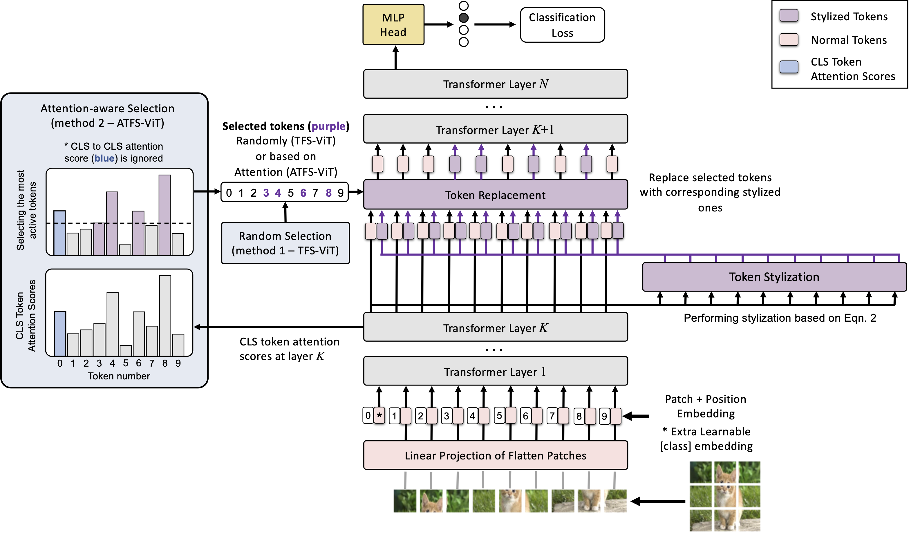
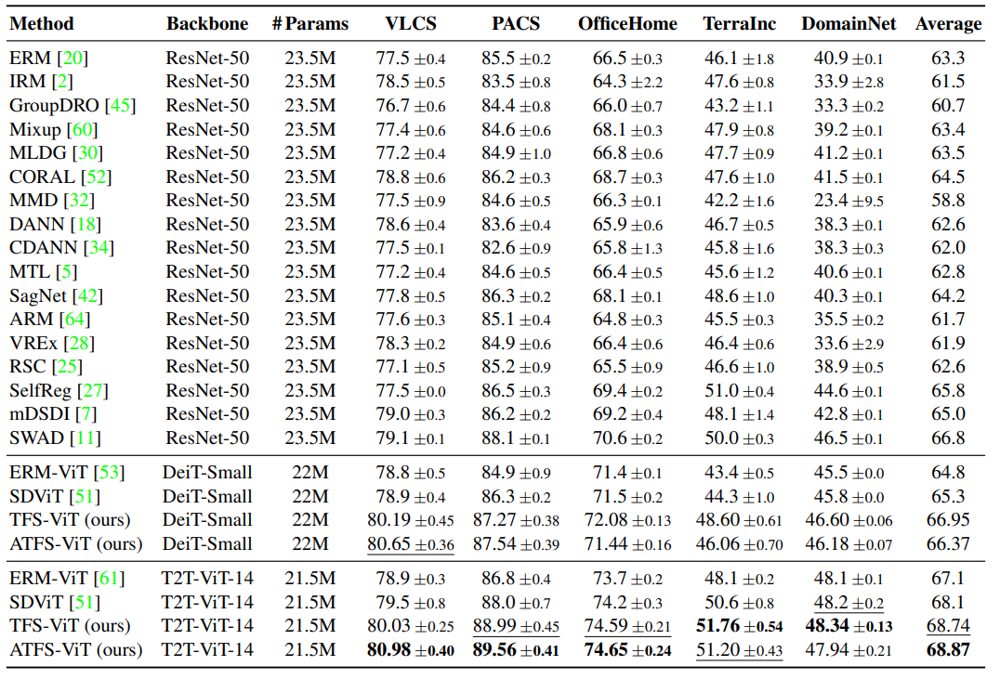
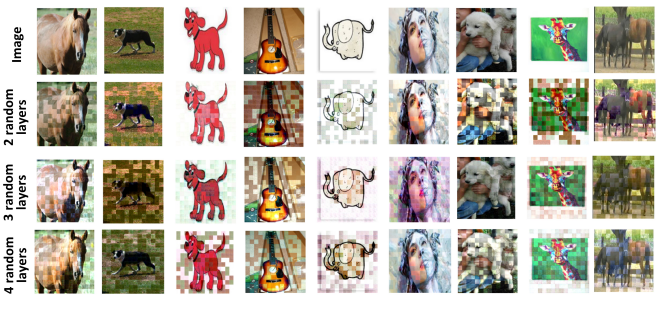

# TFS-ViT: Token-Level Feature Stylization for Domain Generalization

The official implementation of our paper "TFS-ViT: Token-Level Feature Stylization for Domain Generalization".



Standard deep learning models such as convolutional neural networks (CNNs) lack the ability of generalizing to domains which have not been seen during training. This problem is mainly due to the common but often wrong assumption of such models that the source and target data come from the same i.i.d. distribution. Recently, Vision Transformers (ViTs) have shown outstanding performance for a broad range of computer vision tasks. However, very few studies have investigated their ability to generalize to new domains. This paper presents a first Token-level Feature Stylization (TFS-ViT) approach for domain generalization, which improves the performance of ViTs to unseen data by synthesizing new domains. Our approach transforms token features by mixing the normalization statistics of images from different domains. We further improve this approach with a novel strategy for attention-aware stylization, which use the attention maps of class (CLS) tokens to compute and mix normalization statistics of tokens corresponding to different image regions. The proposed method is flexible to the choice of backbone model and can be easily applied to any ViT-based architecture with a negligible increase in computational complexity. Comprehensive experiments show that our approach is able to achieve state-of-the-art performance on five challenging benchmarks for domain generalization, and demonstrate its ability to deal with different types of domain shifts.

### Requirements
- [Python 3.10](https://www.python.org/)
- [CUDA 11.3](https://developer.nvidia.com/cuda-zone)
- [PyTorch 1.12.1](https://pytorch.org/)
- [TorchVision 0.13.1](https://pytorch.org/)
- [Numpy 1.22.3](https://numpy.org/)
- [timm 0.4.12](https://github.com/rwightman/pytorch-image-models)


### Usage
1- Clone the repository

2- Create an environment and Install the requirements

The `requirements.txt` file can be used to install the required dependencies:
```
pip3 install -r /path/to/requirements.txt 
```
or a conda environment can be created as follows:

```
conda create -n tfsvit python==3.10
conda install pytorch==1.12.1 torchvision==0.13.1 torchaudio==0.12.1 cudatoolkit=11.3 -c pytorch
conda install -c conda-forge timm einops==0.3.0
pip install wilds==2.0.0 seaborn==0.11.1
```

3- Download one or all of the datasets

PACS, VLCS, OfficeHome, TerraIncognita, or DomainNet datasets can be downloaded as follows:
```
python3 -m domainbed.scripts.download \
       --data_dir=./domainbed/data --dataset pacs
```

4- Train

To reproduce the results of the paper, first specify `backbone` (DeitSmall or T2T14) , `dataset`(PACS, VLCS, OfficeHome, TerraIncognita, or DomainNet), `data_dir` (where the datasets were downloaded), and `output_dir` (where to save models and log files), in the bash file `./bash_scripts/TFS-ViT/run_sweep.sh` corresponding to our proposed 'TFS-ViT', and then run the following command:

```
bash ./bash_scripts/TFS-ViT/run_sweep.sh
```


Note: there are similar scripts in the `bash_scripts` directory to run `ATFS-ViT` and `ERM-ViT` algorithms. Each experiment is repeated three times. 

5- Evaluating for Domain Generalization

To collect and view the results:

```
python -m domainbed.scripts.collect_results\
       --input_dir=/path/to/the/trained/models/ --get_recursively True
```

### Results
1- Comparison of our proposed methods with previous SOTA on five datasets:



2- Detailed results on the PACS dataset (detailed results of other datasets can be found in the supplementary materials)


### Visualizations
1- Attention Maps

Comparison of attention maps between the baseline ERM-ViT and our proposed TFS-ViT (backbone: DeiT-Small) on different domains of the PACS dataset (attention maps for other datasets can be found in the supplementary materials).


2- Stylization Visualization 

In order to get a better understanding of our proposed token-level feature stylization method, we use a simple ViT-based encoder-decoder network without performing any stylization. When the training is finished, we perform token-level stylization in the encoder using a batch of input images - precisely like what we do in TFS-ViT - and try to reconstruct images to see the effect of stylization at the pixel level (for more details please see the supplementary materials).



As can be seen from the figure, stylizing random layers in addition to stylizing random tokens (in this case d=0.5) results in creating more diverse samples. These diverse synthetic features generated from different domains are able to simulate different kinds of domain shifts during training and accordingly force the network to learn domain-invariant features.


## License

This source code is released under the MIT license, included [here](./LICENSE).

This project is bulit upon [DomainBed](https://github.com/facebookresearch/DomainBed), and uses some code from [SDViT](https://github.com/maryam089/sdvit) (both are MIT licensed). We thank the authors for releasing their codes.
